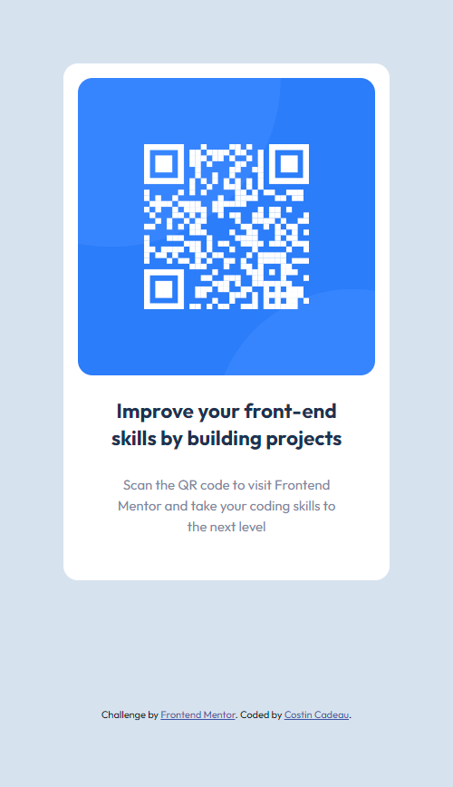
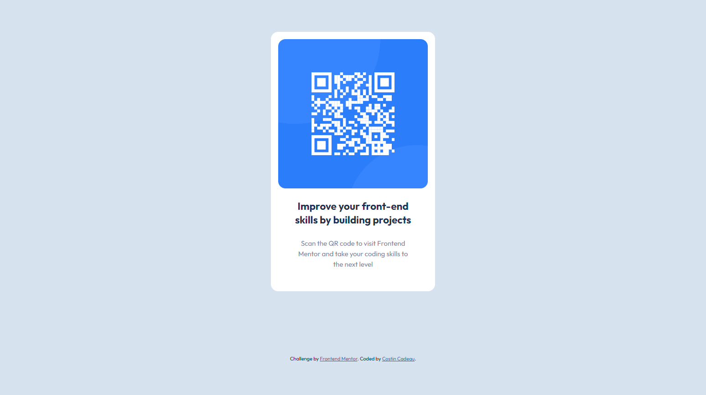

# Frontend Mentor - QR code component solution

This is a solution to the [QR code component challenge on Frontend Mentor](https://www.frontendmentor.io/challenges/qr-code-component-iux_sIO_H). Frontend Mentor challenges help you improve your coding skills by building realistic projects. 

## Table of contents

- [Overview](#overview)
  - [Screenshot](#screenshot)
  - [Links](#links)
- [My process](#my-process)
  - [Built with](#built-with)
  - [Useful resources](#useful-resources)
- [Author](#author)

## Overview

### Screenshot

#### *Mobile version :*

#### *Desktop version :*

### Links

- Live : [https://c-costin.github.io/qr-code-component/](https://c-costin.github.io/qr-code-component/)
- Repo Github: [https://github.com/c-costin/qr-code-component](https://github.com/c-costin/qr-code-component)

## My process

### Built with

- Semantic HTML5 markup
- Flexbox
- CSS BEM Methodologie
- Mobile-first workflow

### Useful resources

- [Bunny Fonts](https://fonts.bunny.net/) - I used their CDN for the font.

## Author

- Website - [costincadeau.fr](https://costincadeau.fr)
- Frontend Mentor - [@c-costin](https://www.frontendmentor.io/profile/c-costin)
